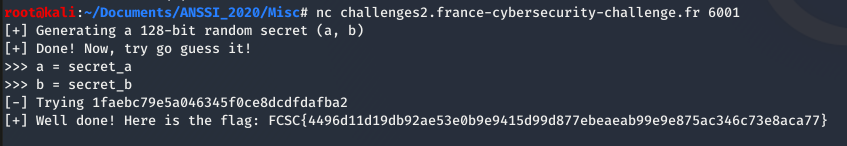

# Randomito - 50

-   [Retour à l'accueil.](../../index.md)

## Description

`Pourrez-vous deviner le secret aléatoire généré ?`

## Solution

Le fichier contenant le script nous est donné. La fonction principale est :

```python
def challenge():
	for _ in range(10):
		p("[+] Generating a 128-bit random secret (a, b)\n")
		secret_a = randint(0, 2**64 - 1)
		secret_b = randint(0, 2**64 - 1)
		secret   = "{:016x}{:016x}".format(secret_a, secret_b)
		p("[+] Done! Now, try go guess it!\n")
		p(">>> a = ")
		a = int(input())
		p(">>> b = ")
		b = int(input())
		check = "{:016x}{:016x}".format(a, b)
		p("[-] Trying {}\n".format(check))
		if check == secret:
			flag = open("flag.txt").read()
			p("[+] Well done! Here is the flag: {}\n".format(flag))
			break
		else:
			p("[!] Nope, it started by {}. Please try again.\n".format(secret[:5]))
```

On nous demande de saisir les valeurs de deux variables **a** et **b**.

La variable check est ensuite créée : `check = "{:016x}{:016x}".format(a, b)`

On compare ensuite **check** avec la variable **secret** générée au départ. Si les deux variables sont égales, on récupère le flag.

La variable **secret** est créée de façon similaire à **check**, à partir de **secret_a** et **secret_b**, deux entiers générés aléatoirement.

Ainsi, puisque **secret_a** et **secret_b** sont généré avant la demande de saisie de **a** et **b**, il suffit d'affecter à **a** et **b** les valeurs des variables **secret_a** et **secret_b**.



-   [Retour à l'accueil.](../../index.md)
