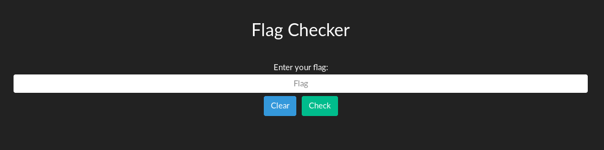
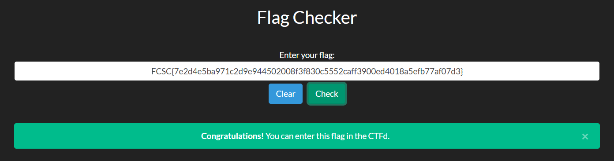

# Flag Checker - 200

-   [Retour à l'accueil.](../../index.md)

## Description

`Voici un service qui permet simplement de vérifier si le flag est correct.`

## Solution



Le fichier contenant le script nous est donné. La fonction principale est :

```js
function checkFlag() {
    (check = Module.cwrap("check", "number", ["string"])),
        (flag = $("#flag").val()),
        check(flag)
            ? ($("#feedback").html(
                  '<div id="alert" class="alert alert-dismissible alert-success"><button type="button" class="close" data-dismiss="alert">&times;</button><strong>Congratulations!</strong> You can enter this flag in the CTFd.</div>'
              ),
              $("#feedback").show())
            : ($("#feedback").html(
                  '<div id="alert" class="alert alert-dismissible alert-danger"><button type="button" class="close" data-dismiss="alert">&times;</button><strong>Incorrect!</strong> Please check your flag again.</div>'
              ),
              $("#feedback").show());
}
```

On vérifie le retour de la fonction check via un opérateur ternaire, si check retourne vrai cela signifie que la valuer de flag rentrée correspond au flag à trouver. On veut donc trouver la valeur pour laquelle check retourne 1, puisqu'il s'agira du flag.

Mais quid de check ?

En jouant un peu avec le debugueur, on constate que la valeur de check proviens de la valeur de ret (dans _index.js_) :

```js
var ret = func.apply(null, cArgs);
ret = convertReturnValue(ret);
if (stack !== 0) stackRestore(stack);
return ret;
```

Ce qui nous amène au fichier _index.wasm_.

Il s'agit de web assembleur, et même si cela peut sembler un peu rebutant en premier lieu, on comprend finalement assez vite ce que font globalement les fonctions. On peut trouver toute les explications nécessaire [ici](https://github.com/sunfishcode/wasm-reference-manual/blob/master/WebAssembly.md#accessed-bytes).

Les parties qui nous intéressent sont les suivantes :

```
func $func0 (param $var0 i32)
    get_local $var0
    set_global $global0
```

```
func $func4 (param $var0 i32) (result i32)
    (local $var1 i32) (local $var2 i32)
    get_local $var1
    call $func3
    i32.eqz
```

On appelle la fonction 3, et on évalue le retour de celle-ci, on retourne vrai si ce retour est égal à 0.

```
func $func3 (param $var0 i32) (result i32)
    (local $var1 i32) (local $var2 i32) (local $var3 i32) (local $var4 i32) (local $var5 i32)
    [...]
    get_local $var1
    i32.load8_u
    i32.sub
```

Dans la fonction 3, on constate que l'on compare les caractères de notre chaine en entrée avec la chaine située à l'adresse 1024 :

```js
(data (i32.const 1024)
    "E@P@x4f1g7f6ab:42`1g:f:7763133;e0e;03`6661`bee0:33fg732;b6fea44be34g0~"
  )
```

Les caractères sont comparés un à un, et si ils correspondent, on passe au suivant.

On dispose alors des éléments suivant :

-   On connait la chaine avec laquelle notre entrée est comparée.
-   On sait que notre entrée correspond au flag (i.e. sera sous la forme **FCSC{** _xxxxxxx_ **}**).
-   La comparaison se fait caractère par caractère (i.e notre chaine sera de même longueur que la chaine trouvée).

Il ne nous reste donc qu'à trouver la transformation appliquée pour passer de l'entrée à `` E@P@x4f1g7f6ab:42`1g:f:7763133;e0e;03`6661`bee0:33fg732;b6fea44be34g0~ ``.

Un élémént attire notre attention : la transformation fait aboutir **FCSC{** à **E@P@x4**. Le caractère C devient @ dans les deux cas. Il s'agit donc d'une transformation linéaire.
On pense alors a un XOR, ce qui serait parfait, puisqu'il s'agit d'une transformation commutative.

La piste semble prometteuse :

```python
>>> print(ord(xor("F", "E")))
3
>>> print(ord(xor("C", "@")))
3
```

On va donc XORer la chaine trouvée avec le caractère _\x03_.

```python
def xor(a, b):
    return ''.join(chr(ord(ac) ^ ord(bc)) for ac, bc in zip(a, b))

def main():
    a = "E@P@x4f1g7f6ab:42`1g:f:7763133;e0e;03`6661`bee0:33fg732;b6fea44be34g0~"
    print(xor(a, "\x03"*len(a)))
```

Bingo !

```
$ python3 flag.py
FCSC{7e2d4e5ba971c2d9e944502008f3f830c5552caff3900ed4018a5efb77af07d3}
```



-   [Retour à l'accueil.](../../index.md)
